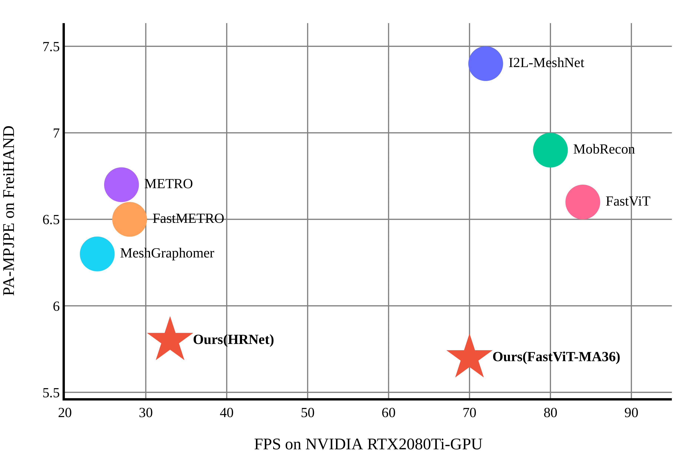

# News

**20240306**: 🔥 Our project page is available. 🚀

**20240228**: 📄 Paper accepted by CVPR 2024. 🎉

**20230930**: 🥇 We won the 1st place in Egocentric 3D Hand Pose Estimation challenge.🏆 [[Technical Report]](https://arxiv.org/abs/2310.04769)

# simpleHand

**[JIIOV Technology](https://jiiov.com/)**

**A Simple Baseline for Efficient Hand Mesh Reconstruction**

Zhishan Zhou, Shihao Zhou, Zhi Lv, Minqiang Zou, Tong Wu, Mochen Yu, Yao Tang, Jiajun Liang

[[`Paper`]](https://arxiv.org/pdf/2403.01813.pdf) [`[Project]`](#getting-started)

**A Simple Baseline for Efficient Hand Mesh Reconstruction (simpleHand)** has been accepted by CVPR2024.  This paper ropose a simple yet effective baseline that not only surpasses state-of-the-art (SOTA) methods but also demonstrates computational efficiency. SimpleHand can be easily transplant to mainstream backbones and datasets.

# Getting Started
code comming soon