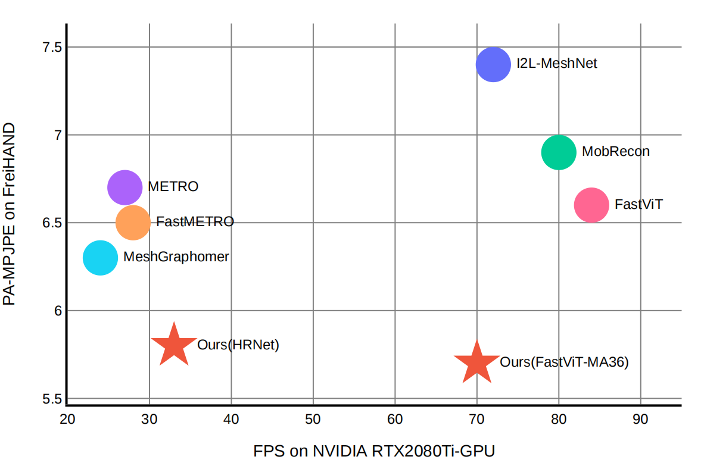
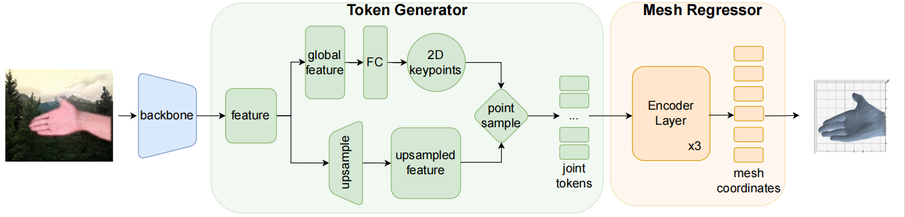
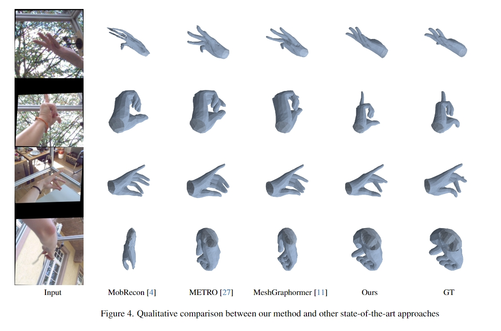

# simpleHand

**[JIIOV Technology](https://jiiov.com/)**

**A Simple Baseline for Efficient Hand Mesh Reconstruction**

Zhishan Zhou, Shihao Zhou, Zhi Lv, Minqiang Zou, Tong Wu, Mochen Yu, Yao Tang, Jiajun Liang

[`Paper`] [[`Project`](https://github.com/patienceFromZhou/simpleHand?tab=readme-ov-file)]

**A Simple Baseline for Efficient Hand Mesh Reconstruction (simpleHand)**   Propose a simple yet effective baseline that not only surpasses state-of-the-art (SOTA) methods but also demonstrates computational efficiency. SimpleHand can be easily transplant to mainstream backbones and datasets.

# Method Overview

 SimpleHand is abstracted into a token generator and a mesh regressor. Token generator samples representative tokens using predicted 2d keypoints. Mesh regressor cascadely lifts the sampled tokens into meshes.

SimpleHand capitalizes on the strengths of existing methodologies, thereby outperforming them in numerous challenging scenarios. This is particularly evident in intricate finger interactions, like pinching or twisting, as well as in complex and unconventional gestures.

# Related JIIOV Product 

JIIOV is working on Extended Reality (XR) hand interaction algorithm and modules. We transplanted simpleHand design into realworld device to make a practically test. It shows advantages especially in finger interaction senario, while retains realtime efficiency. See **[here](https://youtu.be/uiMbRXwvF0Q)** for full example videos.
